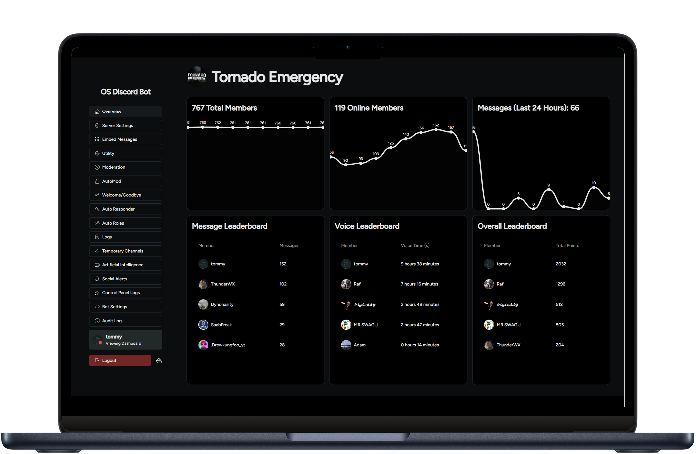

# Multi-Purpose Open Source Discord Bot



This is a multi-purpose Discord bot built using Node.js with the discord.js library. It provides a simple web dashboard along with various bot functionalities.

## Features

- **Web Dashboard**: Includes a basic web server to host a dashboard.
- **Statistics**: General overview of server statistics.
- **Server Settings**: Configure server-specific settings.
- **Embed Messages**: Create and manage embed messages for your server.
- **Utility**: Access various utility commands and tools.
- **Moderation**: Tools and commands for server moderation.
- **AutoMod**: Automated moderation settings and rules.
- **Welcome/Goodbye**: Customize welcome and goodbye messages for new and leaving members.
- **Auto Responder**: Set up automatic responses to specific messages.
- **Auto Roles**: Automatically assign roles to new members.
- **Logs**: View logs of various bot activities.
- **Temporary Channels**: Manage temporary voice and text channels.
- **Artificial Intelligence**: AI Chatbot with optional internet access.
- **Social Alerts**: Set up alerts for social media activity.
- **Control Panel Logs**: Logs related to the bot's control panel activities.
- **Bot Settings**: Configure general bot settings like it's presence.
- **Audit Log**: View the audit log for detailed bot activity tracking.

## Installation

### Using Node.js

1. Clone the repository:

   ```bash
   git clone https://git.timmygstudios.com/tommys-stuff/os-discord-bot.git
    ```
2. Install the dependencies:

   ```bash
   pnpm i
   ```
3. Configure the project by following the [Configuration](#configuration) section.
4. Start the bot:

   ```bash
   pnpm start
   ```
5. Visit `http://localhost:3000` in your browser to access the dashboard.

### Using Docker

1. Clone the repository:

   ```bash
   git clone https://git.timmygstudios.com/tommys-stuff/os-discord-bot.git
    ```
2. Configure the project by following the [Configuration](#configuration) section.
3. Build and start the containers:

   ```bash
   docker-compose up --build
   ```
4. Visit `http://localhost:3000` in your browser to access the dashboard.

## Configuration

To configure the project, rename `config.example.json` to `config.json` file in the root directory. The configuration file should contain the following keys:

- `guildID`: Your Discord Guild (Server) ID.
- `botToken`: Your Discord Bot Token.
- `clientID`: Your Discord Client ID.
- `clientSecret`: Your Discord Client Secret.
- `publicURL`: The public URL where your dashboard will be accessible (e.g., `http://localhost:3000`).
- `twitchClientId`: Your Twitch Client ID (if applicable, required for twitch social alerts).
- `twitchClientSecret`: Your Twitch Client Secret (if applicable, required for twitch social alerts).
- `aiType`: Type of AI service to use (Can be `openai` or `claude`).
- `aiModel`: The AI model to use (e.g., `text-davinci-002`).
- `openAIToken`: Your OpenAI API key.
- `claudeApiKey`: Your Claude API key.
- `sessionSecret`: A secret key for session management.


## Custom Theming

1. Head over to https://zippystarter.com/tools/shadcn-ui-theme-generator
2. Customize the theme to your liking
3. Copy the generated CSS and paste it into `public/theme.css`

## Technologies Used:

- **Backend Technologies:**
  - Node.js
  - npm
  - Express

- **Discord Bot Development:**
  - [discord.js](https://discord.js.org/docs)

- **Frontend Technologies:**
  - [Franken UI](https://www.franken-ui.dev/)
  - Chartist.js
  - jQuery

## Contributing
Contributions to this project are encouraged and appreciated. Please feel free to submit pull requests or open issues if you encounter any problems or have suggestions for improvements.

## License
This project is open source and available under the [MIT License](LICENSE).
